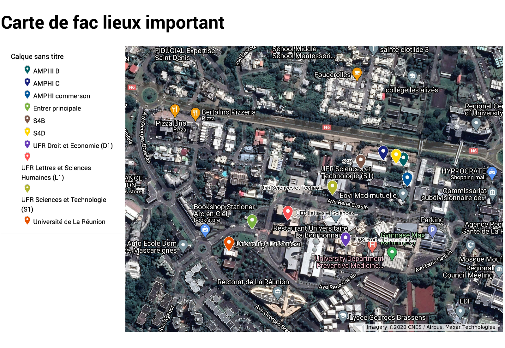

# 🎓 Carte des Lieux Importants - Université de Saint-Denis

Une application web interactive permettant de visualiser les lieux importants du campus de la Faculté des Sciences de l'Université de Saint-Denis (La Réunion).



## ✨ Fonctionnalités

- 🗺️ **Carte interactive** - Navigation fluide avec OpenLayers
- 📍 **Marqueurs intelligents** - Coloration automatique selon le type de lieu :
  - 🔵 Bâtiments universitaires
  - 🟢 Espaces verts
  - 🔴 Restaurants & Cafétérias
  - 🟠 Parkings
  - 🟣 Services (Bibliothèque, Scolarité...)
- 📱 **Responsive** - Affichage optimisé desktop et mobile
- 🔍 **Zoom sur clic** - Cliquez sur un lieu dans la liste pour zoomer
- 📝 **Informations détaillées** - Popup avec description au clic sur un marqueur
- 📦 **Chargement KMZ** - Extraction et affichage automatique du fichier KMZ

## 🚀 Démarrage rapide

### Prérequis
- Un navigateur web moderne (Chrome, Firefox, Safari, Edge)
- Une connexion internet (pour les tuiles OpenStreetMap et les librairies CDN)

### Installation
1. Clonez ou téléchargez ce repository
2. Ouvrez le fichier `index.html` dans votre navigateur

Ou servez avec un serveur local :

```bash
# Avec Python 3
python -m http.server 8000

# Avec Node.js (http-server)
npx http-server

# Avec PHP
php -S localhost:8000
```

Puis accédez à `http://localhost:8000`

## 📁 Structure du projet

```
carteFAC/
├── index.html                    # Page principale
├── css/
│   └── style.css                 # Styles modernes et responsive
├── js/
│   └── map.js                    # Logique de la carte OpenLayers
├── img/                          # Images (optionnel)
├── Carte de fac lieux important.kmz      # Données cartographiques (KMZ)
├── data.kml                      # Données KML (fallback)
└── README.md                     # Documentation
```

## 🛠️ Technologies utilisées

- **OpenLayers 8.2** - Bibliothèque de cartographie interactive
- **JSZip 3.10** - Extraction des fichiers KMZ
- **OpenStreetMap** - Tuiles de carte libres
- **Google Fonts** - Typographie (Alata, Roboto)

## 📝 Format des données

Le fichier `Carte de fac lieux important.kmz` est un fichier KML compressé (ZIP) contenant les coordonnées géographiques des lieux importants du campus. Le fichier KML original est accessible via Google Maps :

```
https://www.google.com/maps/d/kml?mid=1efHg3DJrBuE2uBpgKnpTDEJZACIPw89X
```

## 🎨 Personnalisation

### Modifier les couleurs des marqueurs
Éditez la fonction `getColorByName()` dans `js/map.js` :

```javascript
function getColorByName(name) {
    const lowerName = name.toLowerCase();
    
    if (lowerName.includes('votre-mot-cle')) {
        return '#ff0000'; // Rouge
    }
    // ...
}
```

### Changer la position initiale de la carte
Modifiez la configuration dans `js/map.js` :

```javascript
const mapConfig = {
    center: ol.proj.fromLonLat([longitude, latitude]),
    zoom: 15
};
```

## 📱 Compatibilité

| Navigateur | Version minimale |
|------------|------------------|
| Chrome     | 90+              |
| Firefox    | 88+              |
| Safari     | 14+              |
| Edge       | 90+              |

## 📄 Licence

Projet réalisé par **VIRY Brandon** pour l'Université de Saint-Denis.

Les données cartographiques proviennent d'OpenStreetMap (licence ODbL).

---

💡 *Conseil : Pour une meilleure expérience, utilisez l'application en mode paysage sur mobile.*
